# NEXORA Phase 2C — CORE Dimensional Data Warehouse

## Why a fact constellation (galaxy schema)

NEXORA's Phase 1 data spans eight independent business processes — leads, deals, subscriptions, projects, invoices, payments, support, and customer activity — that all revolve around the same core entities (customer, employee, date). A single star schema can't represent that: it assumes one fact table per model. A fact constellation lets all eight fact tables share a common set of **conformed dimensions** (`DIM_CUSTOMER`, `DIM_EMPLOYEE`, `DIM_DATE`, `DIM_SERVICE`, `DIM_REGION`), so a question that crosses processes — "which regions have both high deal value and high support ticket volume?" — is a join across facts through shared dimensions, not a bespoke pipeline. That cross-process query pattern is exactly what "enterprise decision intelligence" means in practice, which is why a galaxy schema was chosen over eight disconnected stars.

## Source and scope

Source: `NEXORA_DB.STAGING`, restricted everywhere to `_data_quality_status IN ('VALID', 'WARNING')`. INVALID rows never reach CORE (currently 0 INVALID rows exist in the dataset, but the filter is unconditional, not a no-op that happens to matter). RAW and STAGING are read-only from Phase 2C's perspective — nothing in `06_core_dimensions.sql` / `07_core_facts.sql` / `08_core_load.sql` writes to either schema.

## Dimensions

| Dimension | Grain | Type | Source |
|---|---|---|---|
| `DIM_DATE` | one row per calendar day, 2018-01-01 – 2029-12-31 | static reference | generated (covers the live-checked min/max across all ten STAGING date columns: 2018-09-05 – 2028-09-04) |
| `DIM_REGION` | one row per distinct region name | Type 1 | `STG_CUSTOMERS.region` ∪ `STG_EMPLOYEES.region` ∪ `STG_DEALS.region` |
| `DIM_DEPARTMENT` | one row per distinct department name | Type 1 | `STG_EMPLOYEES.department` |
| `DIM_SERVICE` | one row per (name, category) | Type 1, conformed | `STG_DEALS.product` (category `Product`) ∪ `STG_SUBSCRIPTIONS.plan` (category `Subscription Plan`) ∪ `STG_PROJECTS.project_type` (category `Project Type`) |
| `DIM_CUSTOMER` | one row per customer **per version** | SCD Type 2 | `STG_CUSTOMERS` |
| `DIM_EMPLOYEE` | one row per employee **per version** | SCD Type 2 | `STG_EMPLOYEES` |

**`DIM_SERVICE` is a conformed dimension, not three separate ones.** `product`, `plan`, and `project_type` all answer the same underlying question — "which NEXORA offering is this row about?" — just at three different STAGING grains. Rather than creating `DIM_PRODUCT`/`DIM_PLAN`/`DIM_PROJECT_TYPE` (which the task's six-dimension list didn't ask for) or forcing all three into one column (which would lose the distinction), `service_category` keeps them distinguishable while `service_name` stays exactly the STAGING value, unmodified.

**Why `DIM_REGION` and not `DIM_COUNTRY`:** the task asked for a region dimension specifically. `country` stays as a plain attribute on `DIM_CUSTOMER` (customers are the only entity with both region and country in STAGING) rather than becoming a second dimension.

**Why `manager_id` on `DIM_EMPLOYEE` is not a self-referencing surrogate key:** resolving it to a `manager_key` FK pointing back into the same SCD2 table has a real chicken-and-egg problem during the first load (a manager's surrogate key must exist before a report can reference it, but managers and reports load in the same pass) and models an org hierarchy nobody asked for in this phase. `manager_id` is kept as the plain business-key attribute; building `manager_key` resolution is a well-scoped, callable-out future addition, not something this phase silently half-did.

## Facts

Every fact's primary key is its own STAGING business identifier — the grain requested is already unique, so no separate fact surrogate key was added.

| Fact | Grain | Row count (VALID+WARNING) |
|---|---|---|
| `FACT_LEADS` | one row per lead | 15,000 |
| `FACT_DEALS` | one row per deal | 20,000 |
| `FACT_SUBSCRIPTIONS` | one row per subscription | 10,000 |
| `FACT_PROJECTS` | one row per project | 8,000 |
| `FACT_INVOICES` | one row per invoice | 30,000 |
| `FACT_PAYMENTS` | one row per payment | 22,777 |
| `FACT_SUPPORT` | one row per support ticket | 40,000 |
| `FACT_CUSTOMER_ACTIVITY` | one row per activity event | 50,000 |

### Measures actually modeled (vs. requested-but-not-sourced)

Every measure below is either copied verbatim from STAGING or a transparently-derived arithmetic value computed from two STAGING columns — nothing is invented:

- `FACT_DEALS`: `deal_value`, `discount_pct` (both verbatim), plus **`net_deal_value = deal_value * (1 - discount_pct)`** (derived).
- `FACT_SUBSCRIPTIONS`: `mrr` (verbatim), plus **`arr = mrr * 12`** (derived — the standard, universally-defined relationship).
- All other measures (`budget`, `actual_cost`, `completion_pct`, `project_risk_score`, `amount`/`tax`/`total_amount`, `amount_paid`, `days_late`, `resolution_time_hours`, `satisfaction_rating`, `duration_minutes`, `engagement_points`, etc.) are copied verbatim.

Three measures the task listed as examples were **deliberately excluded**, because nothing in STAGING or Phase 1 supports them:

- **`probability`** (deal win probability) — no such column or formula exists anywhere in Phase 1; inventing one would be a business assumption this model has no basis for.
- **SLA hours / SLA breach** on `FACT_SUPPORT` — STAGING has no SLA target or policy field, so there's no "expected resolution time" to compare `resolution_time_hours` against. Flagging a fabricated threshold as an SLA breach would misrepresent the data.
- **Login count / feature usage count / session duration** as `FACT_CUSTOMER_ACTIVITY` measures — the fact's grain is one row per event, and `activity_type` (a degenerate dimension) already tells you an event's kind; "login count" is an aggregate over rows, not a per-row measure, and belongs in a future ANALYTICS-layer view, not CORE.

## Surrogate keys vs. business keys

Every dimension has a warehouse-generated integer surrogate key (`customer_key`, `employee_key`, `service_key`, `region_key`, `department_key`, `date_key`) that facts reference, generated from a Snowflake `SEQUENCE` per dimension (deterministic `YYYYMMDD` for `date_key` instead). The original business/natural key (`customer_id`, `employee_id`, `region_name`, ...) is always kept alongside it — never replaced. Facts store the source business identifier (`lead_id`, `deal_id`, ...) as their own primary key, plus the resolved surrogate keys for whichever dimensions are relevant to that fact.

## SCD Type 2 design (`DIM_CUSTOMER`, `DIM_EMPLOYEE`)

Columns: `effective_from`, `effective_to`, `is_current`, plus an internal `_row_hash` that fingerprints every tracked attribute (via `HASH(CONCAT_WS('|', ...))` over the business columns, with `~` as the null sentinel).

**Load algorithm** (`08_core_load.sql`, `@section: DIM_EMPLOYEE` / `@section: DIM_CUSTOMER`), run every time `python -m etl.load_core` runs:

1. **Expire.** `UPDATE ... SET effective_to = load_date - 1, is_current = FALSE` for every business key whose current row's `_row_hash` no longer matches the freshly-computed hash from STAGING.
2. **Insert.** A fresh current row (`effective_from = load_date`, `effective_to = NULL`, `is_current = TRUE`, new surrogate key) for every business key that is either brand new or was just expired in step 1.

Both steps compare against `_row_hash`, so **a rerun against unchanged STAGING data expires and inserts zero rows** — verified live: running `python -m etl.load_core` twice in a row produced identical row counts both times (`DIM_CUSTOMER` stayed at 5,001, `DIM_EMPLOYEE` at 1,001). Nothing is ever truncated, so no history can be destroyed by a reload.

**This first load created exactly one current version per customer/employee, and nothing else** — no fabricated historical rows. `effective_from` is set to the load date (not a guessed past date, since there is no real "when did this become true" signal for a first-ever load) and `effective_to` is `NULL`.

**How a future change will be handled**, concretely: say `CUST000042`'s `segment` changes from `SMB` to `Mid-Market` on a later `data/raw/` regeneration and Phase 2A/2B reload. On the next `python -m etl.load_core`, that customer's recomputed hash won't match the stored one, so step 1 sets `effective_to` on the existing row and step 2 inserts a new row with a new `customer_key`. The old row is untouched otherwise — still queryable for "what did we believe about this customer as of date X" — and any fact row that referenced the old `customer_key` keeps pointing at that historical version, which is exactly the point of SCD2.

**A documented trade-off, not a bug:** `_row_hash` currently covers *every* tracked attribute, including fast-moving computed scores (`churn_risk_score`, `product_usage_score`, etc.). In a production cadence where those scores are recomputed on every batch, that would mint a new dimension version every load — arguably too granular for a "slowly changing" dimension. Since only one load exists today, this doesn't yet produce any different visible behavior, but a real production system would likely split "genuinely slow-changing" attributes (segment, region, account manager, plan) from "recomputed every batch" scores, and let the latter live in a fact/snapshot table instead. Flagged here rather than silently baked in.

## UNKNOWN member handling

Every dimension reserves surrogate key **`-1`** for an Unknown/Not Applicable member (`DIM_DATE` also gets a `-1` row with `full_date = NULL`). Every fact's dimension lookups are `LEFT JOIN ... COALESCE(x.key, -1)` — a fact row is **never dropped** for failing to resolve a dimension, and its surrogate key column is **never NULL**.

Two genuinely different situations both produce a `-1`, and `etl/validate_core.py` reports them separately rather than conflating them:

- **Benign**: the STAGING source column was itself `NULL` (e.g. an unconverted lead's `converted_date`, an incomplete project's `actual_end_date`, an unresolved ticket's `resolution_date`) — there was nothing to look up. Observed: 28,543 such rows across the dataset.
- **Genuine unresolved lookup**: the source column had a real value that didn't match any dimension row — this would indicate a referential-integrity gap. Observed: **0**, consistent with Phase 1/2A/2B already validating that every foreign-key-shaped ID in this dataset resolves.

## Source-to-target mapping

Every fact's SELECT in `08_core_load.sql` documents its own mapping inline; in summary, each fact is STAGING's columns for that table, minus the four `_source_loaded_at`/`_staged_at`/`_data_quality_status`/`_data_quality_issue` pipeline columns, plus resolved surrogate keys in place of the natural-key/date columns used to look them up, plus (for `FACT_DEALS`/`FACT_SUBSCRIPTIONS`) the two derived measures described above.

## CORE load sequence

```
snowsql -f snowflake/sql/06_core_dimensions.sql   -- sequences + all 6 dimension tables
snowsql -f snowflake/sql/07_core_facts.sql        -- all 8 fact tables
snowsql -f snowflake/sql/08_core_load.sql         -- populate, in dependency order:
                                                   --   DIM_DATE, DIM_REGION, DIM_DEPARTMENT, DIM_SERVICE
                                                   --   DIM_EMPLOYEE (SCD2) -> DIM_CUSTOMER (SCD2, needs DIM_EMPLOYEE)
                                                   --   all 8 FACT_* tables (need every dimension above)
```
or, equivalently and idempotently, `python -m etl.load_core`, which executes those same three files (table setup, then `08_core_load.sql` section-by-section via its `-- @section: NAME` markers), logs each section, and stops at the first failure instead of continuing with a partial load.

## Dimensional model diagram

```mermaid
erDiagram
    DIM_DATE ||--o{ FACT_LEADS : created_date_key
    DIM_CUSTOMER ||--o{ FACT_LEADS : customer_key
    DIM_EMPLOYEE ||--o{ FACT_LEADS : salesperson_employee_key

    DIM_DATE ||--o{ FACT_DEALS : created_close_date_key
    DIM_CUSTOMER ||--o{ FACT_DEALS : customer_key
    DIM_EMPLOYEE ||--o{ FACT_DEALS : sales_rep_employee_key
    DIM_SERVICE ||--o{ FACT_DEALS : service_key
    DIM_REGION ||--o{ FACT_DEALS : region_key

    DIM_DATE ||--o{ FACT_SUBSCRIPTIONS : start_end_date_key
    DIM_CUSTOMER ||--o{ FACT_SUBSCRIPTIONS : customer_key
    DIM_SERVICE ||--o{ FACT_SUBSCRIPTIONS : service_key

    DIM_DATE ||--o{ FACT_PROJECTS : start_planned_actual_date_key
    DIM_CUSTOMER ||--o{ FACT_PROJECTS : customer_key
    DIM_EMPLOYEE ||--o{ FACT_PROJECTS : project_manager_employee_key
    DIM_SERVICE ||--o{ FACT_PROJECTS : service_key

    DIM_DATE ||--o{ FACT_INVOICES : invoice_due_date_key
    DIM_CUSTOMER ||--o{ FACT_INVOICES : customer_key

    DIM_DATE ||--o{ FACT_PAYMENTS : payment_date_key
    DIM_CUSTOMER ||--o{ FACT_PAYMENTS : customer_key
    FACT_INVOICES ||--o{ FACT_PAYMENTS : invoice_id

    DIM_DATE ||--o{ FACT_SUPPORT : created_resolution_date_key
    DIM_CUSTOMER ||--o{ FACT_SUPPORT : customer_key
    DIM_EMPLOYEE ||--o{ FACT_SUPPORT : agent_employee_key

    DIM_DATE ||--o{ FACT_CUSTOMER_ACTIVITY : activity_date_key
    DIM_CUSTOMER ||--o{ FACT_CUSTOMER_ACTIVITY : customer_key

    DIM_CUSTOMER {
        number customer_key PK
        string customer_id "business key"
        number region_key FK
        number account_manager_key FK
        boolean is_current
        date effective_from
        date effective_to
    }
    DIM_EMPLOYEE {
        number employee_key PK
        string employee_id "business key"
        number department_key FK
        number region_key FK
        boolean is_current
        date effective_from
        date effective_to
    }
    DIM_DATE {
        number date_key PK
        date full_date
        number year
        number quarter
    }
    DIM_SERVICE {
        number service_key PK
        string service_name
        string service_category
    }
    DIM_REGION {
        number region_key PK
        string region_name
    }
    DIM_DEPARTMENT {
        number department_key PK
        string department_name
    }
```



## How this supports future analytics

Every fact already carries the surrogate keys an ANALYTICS-layer view or a decision-intelligence model would need: customer-level rollups join through `DIM_CUSTOMER` (and, since it's SCD2, can answer "as of a given date" questions, not just "as of now"); employee/rep performance rollups join through `DIM_EMPLOYEE`; time-series and cohort analysis use `DIM_DATE`'s pre-built calendar attributes (`quarter`, `is_weekend`, etc.) instead of recomputing them per query; and cross-process questions (deal value vs. support load vs. payment delay, all per customer) are a join across facts through `DIM_CUSTOMER` rather than a bespoke extract. None of that is built yet — Phase 2C stops at CORE, as scoped — but the model is shaped so ANALYTICS views, when they come, are `SELECT`s over this layer, not another round of business-logic reinvention.
